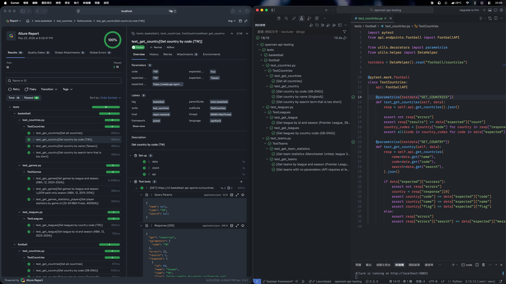

# [OpenNet Home Test] API Automation Testing Framework

An **API** testing framework for the [api-sports.io](https://api-sports.io) APIs (using **API-Football v3** and **API-Basketball v1** as examples), built with **requests**, **Pytest**, and **Allure**.

## Demo

**Live Allure report:** [https://dopiz.github.io/opennet-api-testing/](https://dopiz.github.io/opennet-api-testing/)



- Note that the **api-sports** APIs always respond with **HTTP 200**; success is carried in the body.
- Rate limit (free plan): 100 requests / day.
- One client serves every sport by filling in a `base_url` template (`https://{version}.{component}.api-sports.io`) with values from each endpoint class.

## Example Test Cases

Tests are data-driven: one YAML file per endpoint group, **one key per test function**, each key holding a list of cases.

### Football (`-m football`) — `v3.football.api-sports.io`

| Test                       | Case                                                        | Expected                                              |
| -------------------------- | ----------------------------------------------------------- | ----------------------------------------------------- |
| `test_get_countries`       | Get all countries                                           | ✅ success, contains `GB-ENG`, `FR`, `ES`              |
| `test_get_country`         | Get country by code (`GB-ENG`)                              | ✅ England, flag matches                               |
| `test_get_country`         | Get country by name (`England`)                             | ✅ England, flag matches                               |
| `test_get_country`         | Get country by too-short search term                        | ❌ error message (at least 3 characters)               |
| `test_get_leagues`         | Get leagues by country code (`GB-ENG`)                      | ✅ contains Premier League / Championship / League One |
| `test_get_league`          | Get league by id & season (Premier League, `39`, `2023`)    | ✅ name / country / season start & end                 |
| `test_get_teams`           | Get teams by league & season (Premier League, `39`, `2023`) | ✅ 20 teams, contains Man Utd / Man City               |
| `test_get_teams`           | Get teams with no parameters                                | ❌ errors (≥1 param required)                          |
| `test_get_team_statistics` | Get team statistics (Man Utd, `39`, `2023`)                 | ✅ team name + form string                             |

### Basketball (`-m basketball`) — `v1.basketball.api-sports.io`

| Test                                | Case                                                  | Expected                                |
| ----------------------------------- | ----------------------------------------------------- | --------------------------------------- |
| `test_get_countries`                | Get all countries                                     | ✅ success, contains `TW`, `AU`, `US`    |
| `test_get_country`                  | Get country by code (`TW`)                            | ✅ Taiwan, flag matches                  |
| `test_get_country`                  | Get country by name (`Taiwan`)                        | ✅ Taiwan, flag matches                  |
| `test_get_country`                  | Get country by too-short search term           | ❌ error message (at least 3)               |
| `test_get_leagues`                  | Get leagues by country code (`TW`)                    | ✅ contains P. League+ / SBL / T1 League |
| `test_get_league`                   | Get league by id & season (NBA, `12`, `2023-2024`)    | ✅ name / country / season start & end   |
| `test_get_games`                    | Get games by league & season (NBA, `12`, `2023-2024`) | ✅ expected game count                   |
| `test_get_games`                    | Get games — paid-only season (NBA, `12`, `2013-2014`) | ❌ `errors.plan` message                 |
| `test_get_games_statistics_players` | Get player statistics by game id (`400924`)           | ✅ player points / assists / rebounds    |

## Validation Strategy

api-sports replies **HTTP 200 even on failure**, so the real outcome lives in the body. A full API validation strategy spans several layers — the ones shown in this demo are marked; the rest build on the same framework.

### 1. Per-field request validation

Exercise each request param / body field with correct values, empty values, invalid values, and edge cases. *(example: country code too short, teams with no params, paid-only season)*

### 2. Business-scenario values

Substitute different values to fit specific business logic or user scenarios — e.g. a season the free plan can't access, or a league that exists only in one country.

### 3. Response-field correctness

Assert returned fields match expectations. This can extend to checking the **value persisted in the database** for consistency, or even calling a **third-party service / AI comparison** to verify. *(example: asserts `errors`, `results` count, specific fields in the test body)*

### 4. Status code & response time (and schema) via injected hooks

Validate every response's **status code** and **response time** (a performance guard — in some contexts bad performance is itself a bug), and potentially the **response schema** against the OpenAPI doc. *(example: `StatusValidator` + `ResponseTimeValidator`, injected in `conftest.py`, with a per-call override via `Expect`)*

```python
# Example
football_api.get_country(code="TW", expect=Expect(status=200, max_time=0.3))
```

### 5. Equivalence partitioning

Design cases by input class (one representative per class) to cut run time without losing coverage.

## Tech Stack

| Tool                                                     | Version | Purpose                                           |
| -------------------------------------------------------- | ------- | ------------------------------------------------- |
| [uv](https://github.com/astral-sh/uv)                    | latest  | Python package / venv manager                     |
| [Pytest](https://docs.pytest.org/)                       | 9.0.3   | Test framework                                    |
| [requests](https://requests.readthedocs.io/)             | 2.34.2  | HTTP client (Session, retry adapter, auth)        |
| [allure-pytest](https://pypi.org/project/allure-pytest/) | 2.16.0  | Emits Allure results, `@allure.step`, attachments |
| [Allure](https://allurereport.org/)                      | 3.8.2   | Report generator & viewer (`allure serve`)        |
| [python-dateutil](https://dateutil.readthedocs.io/)      | 2.9.0   | Date parsing/handling in `utils/time.py`          |
| [PyYAML](https://pyyaml.org/)                            | 6.0.3   | Config & test-data loading                        |
| [Ruff](https://github.com/astral-sh/ruff)                | 0.15.14 | Linter & formatter                                |

## Project Structure

```
.
├── .github/workflows/
├── api/                            # Reusable API Library
│   ├── client.py                   # HTTPClient: session, retry, hook pipeline
│   ├── config.py                   # ClientConfig / RetryConfig dataclasses
│   ├── auth.py                     # APIKeyAuth (requests AuthBase)
│   └── endpoints/
│       ├── base_api.py             # BaseAPI: route (version/component) + path → delegates to client
│       ├── football.py             # FootballAPI  (version="v3",  component="football")
│       └── basketball.py           # BasketballAPI (version="v1", component="basketball")
├── common/                         # Shared constants, enums, and dataclasses
│   └── constants.py
├── configuration/                  # Environment-based configuration
│   ├── default.yaml                # base_url, retry, validation defaults
│   └── staging.yaml                # Environment overrides (deep-merged onto default)
├── database/                       # EXAMPLE ONLY — not used by current tests (DB-consistency validation demo)
│   ├── psql_module.py              # Thin psycopg2 wrapper (connect / query helpers)
│   └── football_db.py              # Sample queries showing how DB checks would plug in
├── testdata/                       # Split by component 
│   ├── football/                   # test data files: countries.yaml, leagues.yaml, teams.yaml
│   └── basketball/                 # test data files: countries.yaml, leagues.yaml, games.yaml
├── tests/
│   ├── conftest.py                 # pytest hooks and fixtures
│   ├── football/                   # test files: countries, leagues, teams
│   └── basketball/                 # test files: countries, leagues, games
├── utils/
│   ├── hooks.py                    # CompositeRequestHook, AllureReportHook (injectable hooks)
│   ├── validations.py              # Expect, StatusValidator, ResponseTimeValidator (injectable validator hooks)
│   ├── helper.py                   # Cached YAML file loaders
│   ├── decorators.py               # `parametrize` shorthand for data-driven tests
│   └── time.py                     # Time utilities
├── conftest.py                     # Root pytest hooks and fixtures
├── pytest.ini                      # Default pytest options & markers
├── .pre-commit-config.yaml         # Ruff pre-commit hooks
└── requirements.txt
```

## Setup

### 1. Create virtual environment & install dependencies

```bash
uv venv
source .venv/bin/activate
uv pip install -r requirements.txt
```

### 2. Provide an API key

Get a free key from [dashboard.api-football.com](https://dashboard.api-football.com), then inject at runtime via an environment variable:
```bash
export TEST_API_KEY={your_api_key_here}
```

But during development, you can also set the key straight into `configuration/default.yaml` (`api_key:`) for convenience

### 3. Run tests

```bash
uv run pytest                 # all tests
uv run pytest -m football     # only football
uv run pytest -m basketball   # only basketball
```

## Test Options

| Option        | Default   | Description                                                                 |
| ------------- | --------- | --------------------------------------------------------------------------- |
| `--env`       | `default` | Config environment merged from `configuration/` (e.g. `default`, `staging`) |
| `-m <marker>` | —         | Run a sport group: `football` / `basketball`   |

```bash
# Staging environment
uv run pytest --env=staging

# A single test case
uv run pytest tests/football/test_leagues.py::TestLeagues::test_get_league
```

Any config value can also be overridden at runtime via `TEST_*` environment variables; double underscore maps to nesting, e.g. `TEST_API_KEY` → `api_key`, `TEST_RETRY__MAX_RETRIES` → `retry.max_retries`.

## Allure Report

```bash
# allure-pytest writes results to allure-results/ (enabled by default in pytest.ini)
uv run pytest --alluredir=allure-results

# Generate & open the HTML report
allure serve allure-results
```

## Design Highlights

### Reusable API library

The `api/` package stands alone and can be reused by other projects (e.g., e2e auto, internal tools) as a **package** or git **submodule**.

- **Transport:** `HTTPClient` owns the `requests.Session`, config-driven retry, hook pipeline, timeout, logging, and URL assembly.
- **Resource:** `BaseAPI` + `each endpoint classes` own *what* to call: `version` / `component` (fill the `base_url` template) and the per-endpoint path & params. They delegate to the client.
- **Auth:** `APIKeyAuth` is a `requests.auth.AuthBase` strategy on the session (sets `x-apisports-key`). Pluggable per project via `client.set_auth(...)`, other projects could swap in a different mechanism, e.g., call the Login API to obtain a token/cookie and inject the resulting auth.

### Configuration

- `base_url` is a template (`https://{version}.{component}.api-sports.io`) resolved per endpoint class, so one client serves every sport.
- Other settings like database connection info, retry options, and any other configuration can be pre-defined in the config YAML for the matching environment.
- Layered (Low to High): `default.yaml` → `--env` override (deep-merged) → `TEST_*` env vars (runtime secrets, never committed).

### Injectable hook pipeline

`RequestHook` is the base class that defines the 2 functions `HTTPClient` calls around every request:
- `around_request`: a context manager wrapping the call, runs code before and after it.
- `after_response`: runs once the response is back.

Each project subclasses it to inject its own behavior before / after a request, for example:
- `AllureReportHook` adds the Allure step and record the request param/body/response in `around_request`.
- `StatusValidator` and `ResponseTimeValidator` checks the response status and duration in `after_response`.

`CompositeRequestHook` stacks several hooks, running each in turn, so a suite can combine multiple hooks at once.

> **Why this design?** Validators are **injected** in `conftest.py`, not baked into the client, so the API library stays reusable (other project gets raw responses without test assertions) and baseline checks (status, latency) are applied to every request instead of being repeated in each test.

### Data-driven tests

Test data lives in `testdata/{component}/*.yaml` — **one file per endpoint group, one key per test function**. A `parametrize` decorator (`utils/decorators.py`) feeds each case into an indirect `data` fixture.

```python
testdata = DataHelper().read("football/leagues")

@pytest.mark.football
class TestLeagues:
    @parametrize(testdata["GET_LEAGUE"])
    def test_get_league(self, data):
        ...  # `data` is one case dict
```

### Code Quality & Formatting

Ruff is the linter / formatter, wired into a pre-commit hook:

```bash
pre-commit install       # one-time setup
uv run ruff check .      # lint
uv run ruff format .     # format
```

